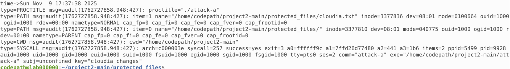
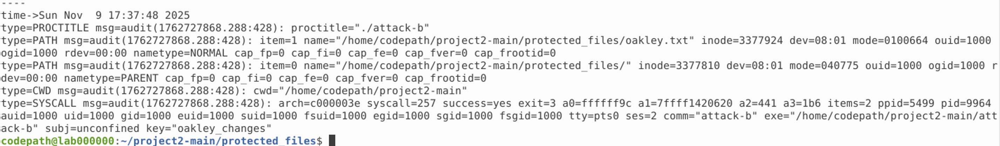
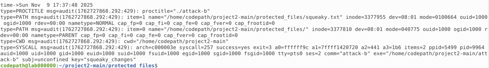
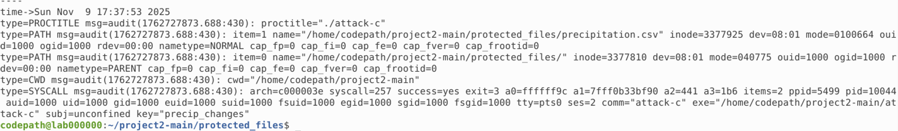

# Project 2: Auditing
Host Intrusion Detection System (HIDS) provides a very efficient way to monitor one's host device for any suspicious activity. In this simulated activity, I used Linux Audit daemon (auditd), which is a HIDS that comes with preconfigured rules, to monitor file changes in directory `/protected_files` and launch three attacks, then track changes made to files in directory
***
## Goals
- Configure Audit rules to monitor file changes in `/protected_files`
- Launch 3 attacks (`attack-a`, `attack-b`, and `attack-c`) on some unknown files in `/protected_files`
- Use Audit to identify which files in `/protected_files` were changed and which attack made those changes

## Tools
- **Ubuntu VM (Microsoft Azure)**: safe cloud-based virtual environment to run attacks on text files and log any changes made to those files
- **Linux Audit daemon (auditd)**: background service (daemon) used to monitor activity on files with customizable rules, for the purpose of this activity, used for Intrusion Detection
## Process
1. Rules
    - In `/etc/audit/rules.d/audit.rules` I added a **watch** rule for each file in `/protected_files` (`cloudia.txt`, `car_sales.csv`, ...)
    - **-w** states that the file will be watched for any alterations
    - **-p** sets the type of permissions to be monitored, in this case, checking **write** permissions
    - **-k** attaches a **filter key**

2. Searching Logs
    - Made each attack executable (`chmod u+x attack-X`) and ran the attacks (`./attack-X`)
    - Searched through the Audit logs using `ausearch` (`sudo ausearch -k <filter_key>`)
   
## Key Findings
The following files were affected by attack-a, attack-b or attack-c:
- `cloudia.txt` was altered by `attack-a`
- `oakley.txt` was altered by `attack-b`
- `squeaky.txt` was altered by `attack-b`
- `precipitation.csv` was altered by `attack-c`

## Screenshots
Screenshots of the output from `ausearch`, which shows the attack file that changed the protected file

`sudo ausearch -k cloudia_changes`

`sudo ausearch -k oakley_changes`

`sudo ausearch -k squeaky_changes`

`sudo ausearch -k precip_changes`

## Reflection
This project helped me honestly appreciate auditing a bit more. Going into this activity, I was expecting to scroll through long logs to determine which attack altered which file. The Linux Audit daemon is a Linux user-friendly HIDS which allows cybersecurity professionals to write custom rules, like watch rules, to check for any suspicious activity like malicious writing to protected files.
